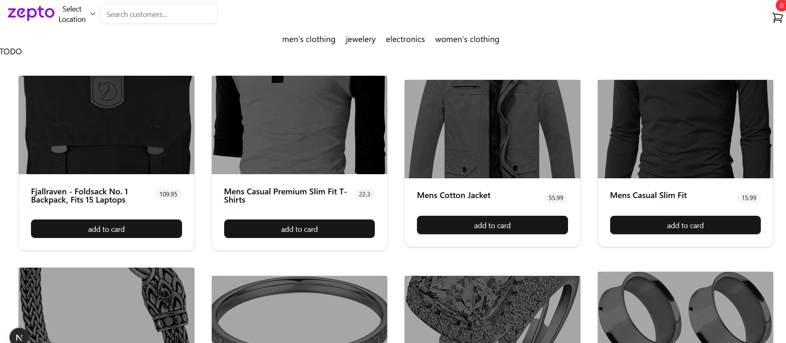

## Setup guide.
First, Intsall required packages.

```bash
pnpm install
```

Then, run the development server:

```bash
pnpm dev
```

Open [http://localhost:3000](http://localhost:3000) with your browser to see the result.

## State management choice explanation.

For state management, I chose to use [Zustand](https://github.com/pmndrs/zustand) as it is a simple and lightweight state management library that is easy to use and integrates well with Next.js.

Zustand is a state management library that provides a simple and scalable solution for managing application state in a Next.js application. It is designed to be easy to use and integrates well with Next.js.


## Screenshots

